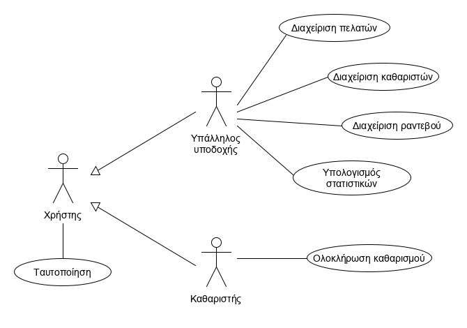
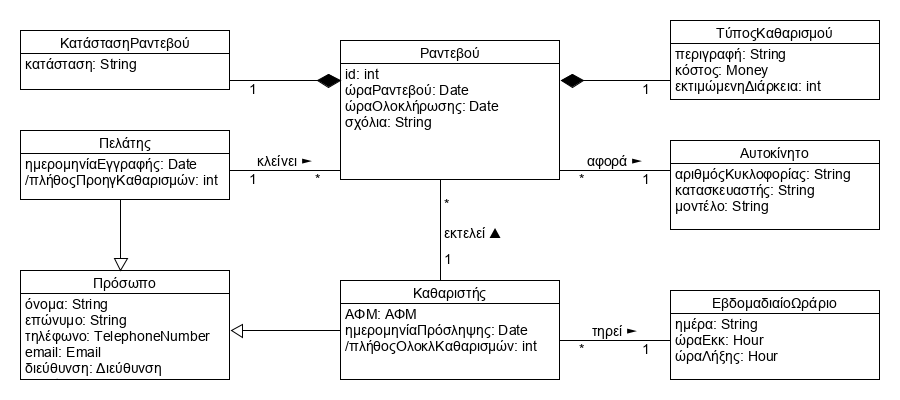
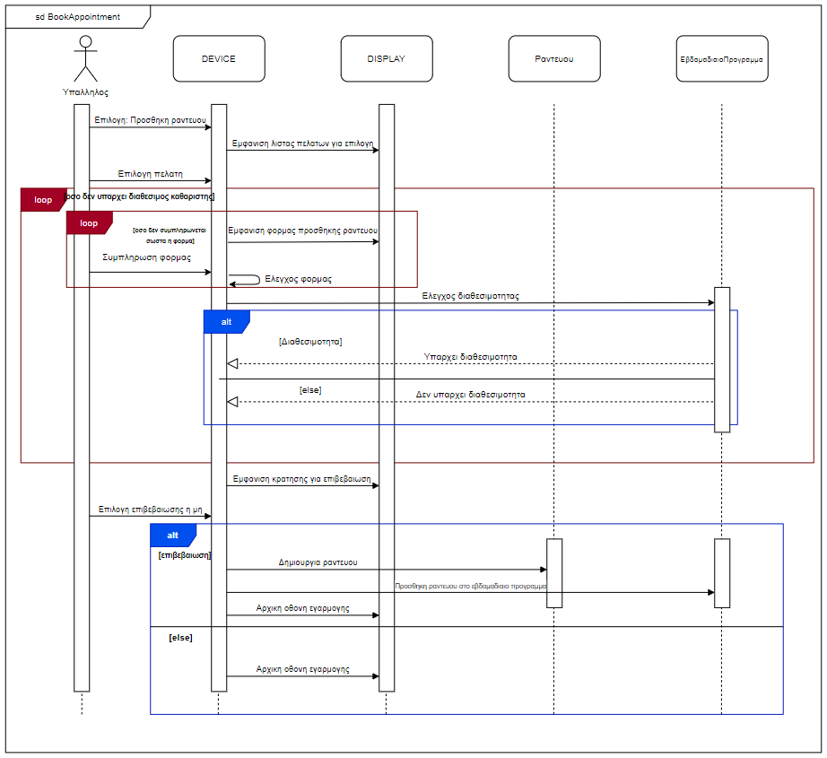

# Car Laundry - Team 11

# Εισαγωγή

Η εφαρμογή αυτή αφορά την διαχείριση πωλήσεων ενός πλυντηρίου αυτοκινήτων. Υποστηρίζει τα καθήκοντα του υπαλλήλου υποδοχής (όπως είναι η καταχώριση των ραντεβού αποτρέποντας τις επικαλύψεις) και των καθαριστών (όπως είναι η ολοκλήρωση ενός καθαρισμού) της επιχείρησης. Το σύστημα, ακόμη, υπολογίζει  χρήσιμα για τη διεύθυνση στατιστικά στοιχεία.

## Επισκόπηση

Σε αυτό το έγγραφο περιλαμβάνονται η περιγραφή της εφαρμογής, το διάγραμμα περιπτώσεων χρήσης και σύντομη περιγραφή των περιπτώσεων χρήσης.

# Συνολική περιγραφή

## Επισκόπηση μοντέλου περιπτώσεων χρήσης

# Ειδικές Απαιτήσεις 

## Περιπτώσεις χρήσης

### Οι ενδιαφερόμενοι και οι ανάγκες τους

Οι ενδιαφερόμενοι είναι ο υπάλληλος υποδοχής, οι πελάτες, οι καθαριστές, αλλά και η διεύθυνση της επιχείρησης.

### Actors του συστήματος

* Χρήστης (Υπάλληλος υποδοχής, Καθαριστής)
* Υπάλληλος υποδοχής
* Καθαριστής

### Περιγραφές περιπτώσεων χρήσης

#### [ΠΧ1 Ταυτοποίηση](requirements/uc1-identification.md)
Πρωτεύον Actor: Χρήστης

Ο Χρήστης (υπάλληλος υποδοχής, καθαριστής) εάν δεν διαθέτει ήδη λογαριασμό, εγγράφεται εισάγοντας λεπτομερώς τα στοιχεία του, αλλιώς συνδέεται στο σύστημα με το όνομα χρήστη και τον κωδικό πρόσβασής του. Αν τα στοιχεία είναι σωστά, ο χρήστης συνδέεται στην αρχική σελίδα της εφαρμογής, διαφορετικά εμφανίζεται μήνυμα λάθους που τον προτρέπει να εισάγει ξανά τα στοιχεία σύνδεσης.

#### [ΠΧ2 Διαχείριση πελατών](requirements/uc2-client-management.md)
Πρωτεύον Actor: Υπάλληλος υποδοχής

Ο υπάλληλος υποδοχής έχει την δυνατότητα να πραγματοποιεί την εγγραφή ενός πελάτη όταν ο τελευταίος προσκομίσει τα κατάλληλα στοιχεία. Στην περίπτωση που η εγγραφή κριθεί επιτυχής, δημιουργείται μια εγγραφή για τον πελάτη στην βάση δεδομένων του συστήματος. Επίσης, ο υπάλληλος μπορεί κατόπιν να  επεξεργάζεται και να επικαιροποιεί αυτά τα στοιχεία ανακτώντας τα από τη βάση, αλλά και να διαγράφει το λογαριασμό κάποιου πελάτη, αν κρίνεται απαραίτητο.

#### [ΠΧ3 Διαχείριση καθαριστών](requirements/uc3-cleaning-stuff-management.md)
Πρωτεύον Actor: Υπάλληλος υποδοχής

Ο υπάλληλος υποδοχής έχει πρόσβαση στα στοιχεία των καθαριστών, όπως και στα στοιχεία των πελατών. Κατά τον ίδιο τρόπο θα μπορεί να προσθέτει καθαριστές στο αρχείο, να επεξεργάζεται τα στοιχεία τους και να διαγράφει κάποιον καθαριστή όταν χρειαστεί. Όλες αυτές οι ενέργειες συνοδεύονται με τα κατάλληλα μηνύματα λάθους ή επιτυχίας από το σύστημα. 

#### [ΠΧ4 Διαχείριση ραντεβού](requirements/uc4-appointment-management.md)
Πρωτεύον Actor: Υπάλληλος υποδοχής

Όταν ο πελάτης επικοινωνήσει με την επιχείρηση για τον προγραμματισμό ραντεβού καθαρισμού και δώσει τις λεπτομέρειες του ραντεβού στον υπάλληλο υποδοχής (είδος πλυσίματος, ώρα ραντεβού κλπ.), ο τελευταίος καταχωρεί τα στοιχεία αυτά στο σύστημα και το σύστημα τον ενημερώνει τον υπάλληλο για το αν η δήλωση του ραντεβού ήταν επιτυχής (δεν υπάρχουν επικαλύψεις), αλλά και τον καθαριστή ο οποίος θα αναλάβει τον καθαρισμό ότι το ραντεβού προστέθηκε στο πρόγραμμά του. Στη συνέχεια, ο υπάλληλος έχει τη δυνατόητα να επεξεργαστεί τις λεπτομέρειες ενός επερχόμενου ραντεβού, αλλά και να ακυρώσει κάποιο αν το ζητήσει ο αντίστοιχος πελάτης.

#### [ΠΧ5 Υπολογισμός στατιστικών ημέρας](requirements/uc5-statistics-calculation.md)
Πρωτεύον Actor: Υπάλληλος υποδοχής

Ο υπάλληλος υποδοχής έχει πρόσβαση σε διάφορα στατιστικά στοιχεία. Ο υπολογισμός των στατιστικών της τρέχουσας ημέρας πραγματοποιείται όταν ο υπάλληλος κρίνει ότι η ημέρα έφτασε στο πέρας της δίνοντας στο σύστημα εντολή υπολογισμού και προκύπτει από ιχνηλάτηση των δεδομένων που υπάρχουν για τα ολοκληρωμένα ραντεβού. Τα στατιστικά των προηγούμενων ημερών αποθηκεύονται σε βάση δεδομένων και ο υπάλληλος μπορεί να τα προβάλει όταν το επιθυμεί και έχουν να κάνουν με την ικανοποίηση των πελατών, τον μέσο χρόνο εξυπηρέτησης, το είδος και τον αριθμό των οχημάτων που προσέρχονται στην επιχείρηση, αλλά και οικονομικά στοιχεία, όπως τα μηνιαία έσοδα.

#### [ΠΧ6 Ολοκλήρωση καθαρισμού](requirements/uc6-cleaning-completion.md)
Πρωτεύον Actor: Καθαριστής

Ο καθαριστής αφού τελειώσει με τον καθαρισμό του οχήματος, ενημερώνει το σύστημα για το γεγονός, και προσθέτει τυχόν σημειώσεις, βλάβες κ.ά. Το σύστημα μετά υπολογίζει το τελικό κόστος πλυσίματος και παράγεται η απόδειξη αγοράς, που εμφανίζεται στον υπάλληλο υποδοχής για να την δώσει στον πελάτη.

## Απαιτήσεις συστήματος

 **Το σύστημα πρέπει:**
		 
 - Να ταυτοποιεί τους χρήστες του.
   
 - Να αποθηκεύει τα δεδομένα που εισάγονται για τα ραντεβού (τύπος καθαρισμού, ώρα ραντεβού κλπ)  σε μία βάση δεδομένων.
   	  
 - Κατά την καταχώριση ραντεβού πρέπει να εξασφαλίζει την αποφυγή
   	   συγκρούσεων τους μεταξύ των πελατών.
 - Να υπολογίζει την τιμή και τον χρόνο στον οποίο θα είναι έτοιμο ένα
   	   όχημα, και να παράγει την σχετική απόδειξη.

 - Να εξάγει στατιστικά στοιχεία προς διεύθυνση επιχείρησης (μέσος χρόνος πλυσίματος, μηνιαία έξοδα κλπ).
	   
 - Να ελέγχει την διαθεσιμότητα των καθαριστών για μελλοντικό πλύσιμο μέσω ραντεβού.

**O υπάλληλος υποδοχής της επιχείρησης θα μπορεί:**
		 
	 
 - Να έχει πρόσβαση σε παλαιότερες συναλλαγές και στοιχεία του των πελατών μέσω του συστήματος.
 
 - Να καταχωρεί το είδος του πλυσίματος που επιθυμεί ο πελάτης και ένα χρονικό διάστημα αναμονής.
 
 - Να μπορεί να διαχειρίζεται το αρχείο καθαριστών.
 
**Ο πελάτης πρέπει:**
  
 - Να μπορεί να κλείσει τηλεφωνικό ραντεβού για καθαρισμό επικοινωνώντας με τον υπάλληλο υποδοχής.
 
**Ο καθαριστής πρέπει:**
  
 - Να μπορεί να ενημερώσει το σύστημα για την ολοκλήρωση των καθαρισμών που αναλαμβάνει.

# Υποστηρικτικό υλικό

## Συμπληρωματικές προδιαγραφές

### Ποιοτικά χαρακτηριστικά

#### Απόδοση

* Το σύστημα ανακτά πληροφορίες από τη βάση δεδομένων σε χρονικό διάστημα <200 ms.
* Η βάση δεδομένων του συστήματος χρησιμοποιεί αλγορίθμους βελτιστοποίησης ώστε ο χρόνος ανάκτησης των δεδομένων να είναι ο επιθυμητός.

#### Διαθεσιμότητα

* Το σύστημα είναι διαθέσιμο ανά πάσα χρονική στιγμή στον υπάλληλο υποδοχής, καθώς βρίσκεται τοπικά στον υπολογιστή.
* Υπάρχει και δεύτερος υπολογιστής με το σύστημα εγκατεστημένο και αντίγραφο της βάσης δεδομένων.
* Η βάση δεδομένων αντιγράφεται σε backup ανά τακτά χρονικά διαστήματα.

#### Ασφάλεια

* Το σύστημα βρίσκεται σε τοπικό υπολογιστή εταιρείας και έτσι αποφεύγονται επιθέσεις μέσω διαδικτύου.
* Το λειτουργικό σύστημα στο οποίο βρίσκεται το σύστημα προστατεύεται με ασπίδα προστασίας.

#### Ευελιξία

* Το σύστημα προσφέρει στο χρήστη ανά πάσα χρονική στιγμή την επιλογή να ακυρώσει την τελευταία του ενέργεια.
* Προσφέρεται πάντα στον χρήστη η δυνατότητα διαγραφής μιας καταχώρησης στη βάση δεδομένων.

#### Ευχρηστία

* Η διεπαφή της εφαρμογής δίνει έμφαση στις πιο συχνές λειτουργίες με μεγαλύτερα μεγέθη κουμπιών και διαφορετικά χρώματα.
* Η εφαρμογή έχει λιτό σχεδιασμό με τα πιο απαραίτητα στοιχεία μόνο να εμφανίζονται στη διεπαφή της.

## Μοντέλο πεδίου

## Ανάλυση περιπτώσεων χρήσης
--------------------------

### Συμπεριφορές

#### Δημιουργία ραντεβού

#### Ολοκλήρωση καθαρισμού

## Επιχειρησιακοί κανόνες

\[*Ένας πίνακας με του επιχειρησιακούς κανόνες. Βλέπε πίνακα 3-4 του παραδείγματος 3-1 στη σελίδας 133 του βιβλίου.*\]

| Επιχειρησιακοί κανόνες | Περιγραφή |
| :----------------------| :---------|
| ΕΚ1 | O Αριθμός Δελτίου Ταυτότητας και το ΑΦΜ είναι μοναδικά για κάθε πελάτη και καθαριστή
| ΕΚ2 | Όλα τα στοιχεία του πελάτη είναι υποχρεωτικά
| ΕΚ3 | Η ηλικία του πελάτη και του καθαριστή θα πρέπει να είναι μεγαλύτερη των 18 ετών
| ΕΚ4 | Το τηλέφωνο του πελάτη και του καθαριστή θα πρέπει να είναι δεκαψήφιος αριθμός που να ξεκινά με '210' ή '69'
