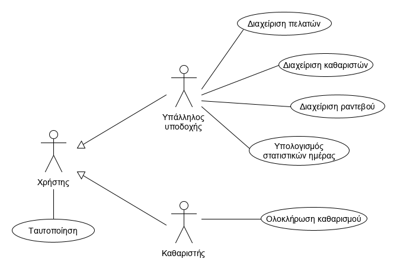

# Car Laundry - Team 11

# Εισαγωγή

Αυτή η εφαρμογή αφορά την διαχείριση πωλήσεων ενός πλυντηρίου αυτοκινήτων. Ο πελάτης, αν δεν διαθέτει λογαριασμό στην πλατφόρμα, έρχεται στον χώρο της επιχείρησης με το αυτοκίνητό του και επικοινωνεί με τον υπάλληλο υποδοχής, ο οποίος καταχωρεί τις λεπτομέρειες του αιτήματός του (είδος πλυσίματος, στοιχεία πελάτη, καθαριστής κτλ.) και τον παραπέμπει στον καθαριστή. Το σύστημα υπολογίζει την τιμή και τον χρόνο αναμονής και παράγει την απόδειξη αγοράς. Αν ο πελάτης είναι εγγεγραμμένος στην πλατφόρμα, μπορεί να συνδεθεί online στην εφαρμογή για να κλείσει ραντεβού λαμβάνοντας κάποια έκπτωση. Η ημερομηνία, η ώρα, αλλά και οι λεπτομέρειες κάθε συναλλαγής αποθηκεύονται σε βάση δεδομένων. 

Ο υπάλληλος υποδοχής έχει, ακόμη, τη δυνατότητα να καταχωρεί για κάποιον πελάτη την αίτησή του για μελλοντικό καθαρισμό  έπειτα από τηλεφωνική επικοινωνία. Επίσης, μπορεί να διαχειρίζεται τα ραντεβού, τους εγγεγραμμένους πελάτες και τους καθαριστές. Το σύστημα παράγει χρήσιμα για την διεύθυνση της επιχείρησης στατιστικά στοιχεία, όπως μέσος χρόνος πλυσίματος, μηνιαία έσοδα και μέση ημερήσια προσέλευση πελατών.

## Επισκόπηση

Σε αυτό το έγγραφο περιλαμβάνονται η περιγραφή της εφαρμογής, το διάγραμμα περιπτώσεων χρήσης και σύντομη περιγραφή των περιπτώσεων χρήσης.

# Συνολική περιγραφή

## Επισκόπηση μοντέλου περιπτώσεων χρήσης

# Ειδικές Απαιτήσεις 

## Περιπτώσεις χρήσης

### Οι ενδιαφερόμενοι και οι ανάγκες τους

Οι ενδιαφερόμενοι είναι ο υπάλληλος υποδοχής (ο οποίος έχει δικαιώματα διαχειριστή), οι πελάτες, αλλά και η διεύθυνση της επιχείρησης.

### Actors του συστήματος

* Υπάλληλος υποδοχής (admin)
* Πελάτης

### Περιγραφές περιπτώσεων χρήσης

#### ΠΧ1 Διαχείριση ραντεβού
Actor: Υπάλληλος υποδοχής
Α) Προσθήκη ραντεβού
Β) Επεξεργασία ραντεβού
Γ) Διαγραφή ραντεβού

#### ΠΧ2 Διαχείριση πελατών
Actor: Υπάλληλος υποδοχής
Α) Προσθήκη πελάτη
Β) Επεξεργασία στοιχείων πελάτη
Γ) Διαγραφή πελάτη

#### ΠΧ3 Διαχείριση καθαριστών
Actor: Υπάλληλος υποδοχής
Α) Προσθήκη καθαριστή
Β) Επεξεργασία στοιχείων καθαριστή
Γ) Διαγραφή καθαριστή

#### ΠΧ4 Προβολή στατιστικών
Actor: Υπάλληλος υποδοχής

#### ΠΧ5 Εγγραφή
Actor: Πελάτης

#### ΠΧ6 Είσοδος
Actor: Πελάτης

#### ΠΧ7 Καταχώριση ραντεβού
Actor: Πελάτης

#### ΠΧ8 Προβολή ιστορικού
Actor: Πελάτης